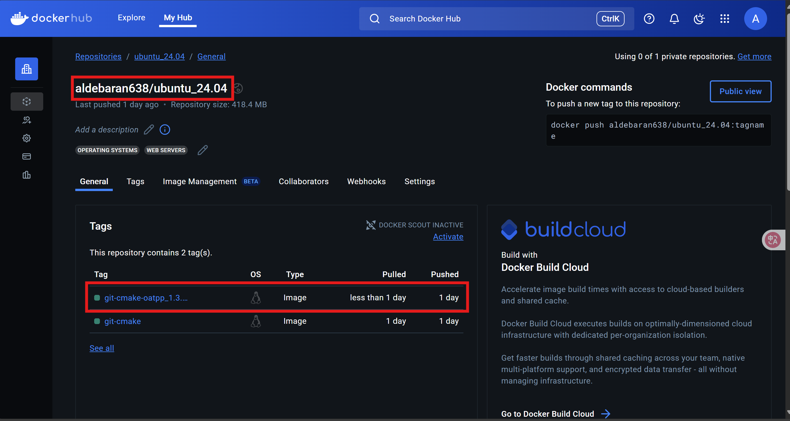

# 2025/05/23

## Docker 镜像构建与优化

**做了什么：**  

  编写了一个后端部署 Dockerfile，内容为将安装包（oatpp 组件、connector/C++ 安装包）和源代码复制进入空 Ubuntu 镜像，然后升级 apt，下载必要组件（cmake、git 和 g++）。最后编译执行源代码完成启动。
  
  **问题1：**  
  测试 Dockerfile 功能时，如果只改 Dockerfile 中的内容（如第 24 行），那么 24 行之前的所有内容是有缓存的，可以一口气执行完。但如果相关的文件改了内容，比如源代码，那就要全部重新走一遍。由于安装一些组件非常耗时间（比如 cmake 和 oatpp），所以测试的时候安装了好几次 cmake 和 oatpp，非常浪费时间。

  **解决方案：**  
  先写一个 Dockerfile，创建一个安装好了 cmake 和 oatpp 的 Ubuntu 系统镜像，然后再在这个镜像的基础上去搭建最后的镜像。免去了大量下载时间。

  将本地的镜像上传到 DockerHub 的办法：  
  先将本地镜像名字改成 `<用户名>/<镜像名>:<版本号>` 的格式,如`aldebaran638/Ubuntu_24.04:git-cmake-oatpp_1.3.1`。  
  修改方式为：  
  ```bash
  docker tag <原名称> <修改后的名称>
  ```
  然后直接 push，指令为：  
  ```bash
  docker push <镜像名>
  ```
  push 以后，docker 会根据名字，在 aldebaran638 用户的 Ubuntu_24.04 系列镜像（类似一个仓库）中添加一个 git-cmake-oatpp_1.3.1 版本镜像。
  

  当然，既然能 push，docker 肯定有登录功能。  
  首先如果已经登录要换用户，先要：
  ```bash
  docker logout
  ```
  然后：
  ```bash
  docker login
  ```
  按提示登录即可。如果登录后未退出直接 `docker login`，终端会输出几个信息以后，等候几秒自动退出进程。

**问题2:**  
  有时候在 Dockerfile 里面下载 cmake 等组件时，可能会遇到 file to fetch问题（随机触发），但是手动重试就可以。

  **解决方案：**  
  需要在这些步骤中添加 shell 的循环，在这些步骤执行失败的情况下自动重试（当然如果成功就直接退出）。举个例子：

  ```dockerfile
  RUN echo "升级apt-get工具"
  RUN for i in 1 2 3; do apt-get update && break || (echo "升级apt-get工具失败,重试次数$i" && sleep 2); done
  ```
# 2025/05/26

## 部署第一版与开始第二版

**做了什么：**  
  整了个阿里云服务器用于部署测试功能;
  成功将第一版部署在云服务器上,可以正常访问与运行;
  编写第二版开发分支dev2的工作流,内容为:自动在Github Action启动容器部署,然后再从Action上部署在云服务器上;
  使用Excel编写第二版后端开发文档(写的时候Excel体验明显好于markdown).写了这个才算彻底明白第二版该如何做了.
  完成项目聊天室部分后端第二版的所有开发,并推送到dev2分支上用于测试
  **问题:**
  暂无

# 2025/05/27

## 前后端对接文本问题,

**做了什么：**  

  开发小鹅通后端websocket部分(修改表结构);开发小鹅通首页以及回放信息获取接口;帮人修复了一个难以定义问题位置的bug;参加项目组会
  
  **问题与解决方案1：**  
  对于前后端对接,假设有一个下拉下表,类型有修厕所/修马路/修水管三个,然后这三个类型在后端对应的code分别是100,101,102.由于前端不具备code转文本的责任,所以调用类似查询的接口(返回值包含上述类型信息相关字段)的时候,后端不仅需要返回code,还需要专门添加一个txt字段包含映射完毕以后的文本.前端即可直接拿文本直接渲染.
  对于swagger,需要将这种包含几种类型的接口的默认值改为类似"修厕所 100/修马路 101/修水管 102"
  对于删除接口,在实际业务开发中,不能真的直接删除对应的内容,只需要打上一个标记即可,因为用户可能有撤销操作

  **问题2：**
  今天遇到了一些难以定位的编译错误问题,如:
```bash
  oatpp::data::mapping::type::ObjectWrapper<ObjT,oatpp::data::mapping::type::__class::Object<ObjT>>::ObjectWrapper”: 没有重载函数可以转换所有参数类型  
```
  这种报错很难定位到自己写的代码(当然源码也基本不可能错).如何确定到底是自己的哪个部分出错了?
  **解决方案：**  
  先确定一个大致的范围,比如一个函数.
  接着对可疑的代码逐个注释,然后运行.注释到哪个代码就是哪里有问题,然后着重检查对应位置即可
