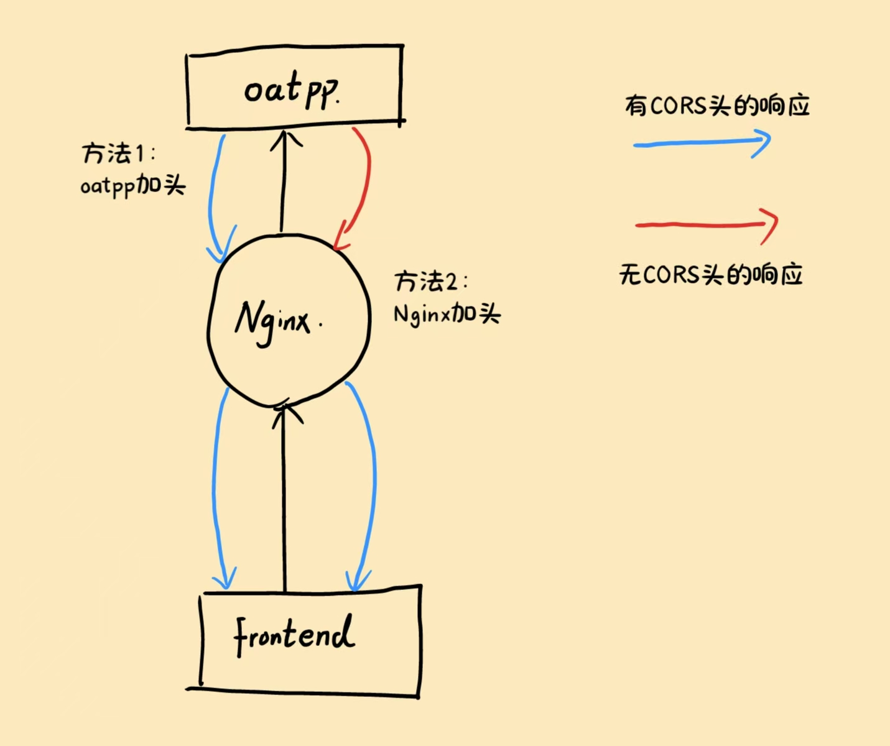

# 2025/05/23

## Docker 镜像构建与优化

**做了什么：**  

  编写了一个后端部署 Dockerfile，内容为将安装包（oatpp 组件、connector/C++ 安装包）和源代码复制进入空 Ubuntu 镜像，然后升级 apt，下载必要组件（cmake、git 和 g++）。最后编译执行源代码完成启动。
  
  **问题1：**  
  测试 Dockerfile 功能时，如果只改 Dockerfile 中的内容（如第 24 行），那么 24 行之前的所有内容是有缓存的，可以一口气执行完。但如果相关的文件改了内容，比如源代码，那就要全部重新走一遍。由于安装一些组件非常耗时间（比如 cmake 和 oatpp），所以测试的时候安装了好几次 cmake 和 oatpp，非常浪费时间。

  **解决方案：**  
  先写一个 Dockerfile，创建一个安装好了 cmake 和 oatpp 的 Ubuntu 系统镜像，然后再在这个镜像的基础上去搭建最后的镜像。免去了大量下载时间。

  将本地的镜像上传到 DockerHub 的办法：  
  先将本地镜像名字改成 `<用户名>/<镜像名>:<版本号>` 的格式,如`aldebaran638/Ubuntu_24.04:git-cmake-oatpp_1.3.1`。  
  修改方式为：  
  ```bash
  docker tag <原名称> <修改后的名称>
  ```
  然后直接 push，指令为：  
  ```bash
  docker push <镜像名>
  ```
  push 以后，docker 会根据名字，在 aldebaran638 用户的 Ubuntu_24.04 系列镜像（类似一个仓库）中添加一个 git-cmake-oatpp_1.3.1 版本镜像。
  

  当然，既然能 push，docker 肯定有登录功能。  
  首先如果已经登录要换用户，先要：
  ```bash
  docker logout
  ```
  然后：
  ```bash
  docker login
  ```
  按提示登录即可。如果登录后未退出直接 `docker login`，终端会输出几个信息以后，等候几秒自动退出进程。

**问题2:**  
  有时候在 Dockerfile 里面下载 cmake 等组件时，可能会遇到 file to fetch问题（随机触发），但是手动重试就可以。

  **解决方案：**  
  需要在这些步骤中添加 shell 的循环，在这些步骤执行失败的情况下自动重试（当然如果成功就直接退出）。举个例子：

  ```dockerfile
  RUN echo "升级apt-get工具"
  RUN for i in 1 2 3; do apt-get update && break || (echo "升级apt-get工具失败,重试次数$i" && sleep 2); done
  ```

# 2025/05/25

## 搭建开发用简易CI/CD工作流

**做了什么：**  

  搭建了前后端开发分支dev2使用的简易CI/CD工作流
  
  **问题**  

  在搭建工作流之前,前端后端是分离开发的.在各自开发的时候比较顺利,但是到了对接阶段,由于前后端没有统一的环境,所以前后端开发者必须各自在自己的开发环境中部署另一方的运行环境.不仅如此,前后端开发人员对另一方的环境也并不了解,所以两者都要在对方的计算机上帮助对方部署自己的环境.这严重影响了开发效率.

  **解决方案**

  部署CI/CD工作流

  什么是CI/CD工作流?
    简单来说,这是一个能把当前项目代码搬到一个**完全干净的环境**,然后自动执行**开发者设定的一系列脚本命令**(一般用于部署和启动项目)的工具.

如何部署CI/CD?

用本项目举例.本项目第一版开发分支为dev,里面存储着前端和后端的代码.本项目使用Github Action部署工作流.
    
第一步:在仓库dev分支下创建以下结构的.github文件夹
```
.github
|-workflows
  |-workflow.yml
```
其中.github和workflows两个目录的名字是固定的,而工作流文件的名字可以自定义

以下是一个简单的工作流文件示例,添加了新手上手Github Action所需要了解的基础知识的注释
```yml
name: Deploy # 工作流名称

on: # on下面的内容规定了工作流触发的方式
  push: # 方式1:向线上仓库dev分支push内容
    branches:
      - dev
  pull_request: # 方式2:从线上仓库dev分支拉取内容
    branches:
      - dev
  workflow_dispatch:  # 方式3:添加手动触发器,设置工作流可以手动触发工作流流程

jobs: # jobs下面的内容规定了功能工作流需要做的工作
  deploy:
    runs-on: ubuntu-24.04 # 规定项目运行的系统环境
    
    steps: # 以下为开发者规定工作流所做的工作流程
      - name: Checkout Code 
        uses: actions/checkout@v3 # 工作1:拉取(检出)当前仓库的代码到第三版GitHub Actions 的运行环境(微软提供的完全干净的线上虚拟机环境)中

      - name: Set up SSH 
        uses: webfactory/ssh-agent@v0.8.0 # 工作2在 GitHub Actions 的运行环境中配置 SSH 私钥,用于在后续步骤能够远程连接到部署的目标服务器.具体设置Actions私钥的方法这里就不多赘述
        with:
          ssh-private-key: ${{ secrets.SSH_PRIVATE_KEY }} # 这里SSH_PRIVATE_KEY是远程连接


      - name: Deploy to Server
        run: | # 工作3:执行开发者规定的一系列脚本.这里的脚本内容是先ssh连接部署的目标服务器,然后再在部署服务器上执行命令以启动项目
          ssh -o StrictHostKeyChecking=no root@47.47.47.47 <<EOF
          cd /home/admin
          cd xet-OnlineLivingStream
          git switch dev
          git pull origin dev
          cd ..
          /home/admin/xet-OnlineLivingStream/local-deploy.sh
          EOF

```
完成上述工作,当push或者pull dev分支时,Github就会自动执行工作流中规定的所有步骤.这样前后端就有一个统一的47.47.47.47运行环境了.

CI/CD解决了什么问题?

CI/CD保证前后端有一个统一的环境.自动化的部署保证前端/后端开发完一个模块并合并到dev分支时,能够立即在部署环境(47.47.47.47)中观察到该模块部署的结果

# 2025/05/26

## 部署第一版与开始第二版

**做了什么：**  
整了个阿里云服务器用于部署测试功能;

成功将第一版部署在云服务器上,可以正常访问与运行;

编写第二版开发分支dev2的工作流,内容为:自动在Github Action启动容器部署,然后再从Action上部署在云服务器上;

使用Excel编写第二版后端开发文档(写的时候Excel体验明显好于markdown).写了这个才算彻底明白第二版该如何做了.

完成项目聊天室部分后端第二版的所有开发,并推送到dev2分支上用于测试

  **问题:**
  暂无

# 2025/05/27

## 前后端对接问题

**做了什么：**  

  开发小鹅通后端websocket部分(修改表结构);开发小鹅通首页以及回放信息获取接口;帮人修复了一个难以定位问题位置的bug;参加项目组会
  
  **问题与解决方案1：**  

对于前后端对接,假设有一个下拉下表,类型有修厕所/修马路/修水管三个,然后这三个类型在后端对应的code分别是100,101,102.由于前端不具备code转文本的责任,所以调用类似查询的接口(返回值包含上述类型信息相关字段)的时候,后端不仅需要返回code,还需要专门添加一个txt字段包含映射完毕以后的文本.前端即可直接拿文本直接渲染.

对于删除接口,在实际业务开发中,不能真的直接删除对应的内容,只需要打上一个标记即可,因为用户可能有撤销操作

  **问题2：**
  今天遇到了一些难以定位的编译错误问题:
```bash
oatpp::data::mapping::type::ObjectWrapper<ObjT,oatpp::data::mapping::type::__class::Object<ObjT>>::ObjectWrapper”: 没有重载函数可以转换所有参数类型  
```
  这种报错很难定位到自己写的代码(当然oatpp源码也基本不可能错).如何确定到底是自己的哪个部分出错了?

  **解决方案：**  
先确定一个大致的范围,比如一个函数.
接着对可疑的代码逐个注释,然后运行.注释到哪个代码就是哪里有问题,然后着重检查对应位置即可

# 2025/05/30

## 直播流工具ffmpeg与nginx-rtmp的使用

**做了什么：**  

  后端增加直播流接收与转存工具模块，配合前端完成直播功能
  
**问题1：**
  今天遇到了一些难以定位的编译错误问题:
```bash
oatpp::data::mapping::type::ObjectWrapper<ObjT,oatpp::data::mapping::type::__class::Object<ObjT>>::ObjectWrapper”: 没有重载函数可以转换所有参数类型  
```
  这种报错很难定位到自己写的代码(当然oatpp源码也基本不可能错).如何确定到底是自己的哪个部分出错了?

**解决方案：**  
先确定一个大致的范围,比如一个函数.
接着对可疑的代码逐个注释,然后运行.注释到哪个代码就是哪里有问题,然后着重检查对应位置即可

# 2025/06/03：项目总结（包括新学到的东西、开始记录之前碰到的问题以及项目可改进点）

## 主题1：CORS跨域问题

  ### “域名” 与 “子域”

  ### 同源地址、同源策略（Same-Origin Policy, SOP）跨域资源共享策略（CORS）是什么

  #### 同源地址、跨域请求、同源策略（Same-Origin Policy, SOP）跨域资源共享策略（CORS）概念陈述

**同源地址**指的是访问协议、域名与端口都完全一样的地址。举一个网址的例子：http://www.baidu.com:80/home。这个网址包含三部分，分别是http访问协议、www.baidu.com域名、80访问端口和/home访问路径。那么

|             addr1             |             addr2             |   Same-Origin?    |
|-------------------------------|-------------------------------|-------------------|
| http://www.baidu.com:80/home  | http://www.baidu.com:80/food  |        ✅         |
| https://www.baidu.com:80/home | http://www.baidu.com:80/home  |        ❌协议不一样|
| http://www.baidu.com:80/home  | http://www.baidu.com:88/home  |        ❌端口不一样|
| http://www.baidu.com:80/home  | http://www.dubai.com:80/home  |        ❌域名不一样|


一个地址的脚本向另一个非同源的地址发送的请求被称为**跨域请求**。

**浏览器同源策略（Same-Origin Policy, SOP）**是一种现代浏览器用来管理 一个域下的网页向另一个域发送的的请求 的安全规则。在现代浏览器中，为了保证用户隐私安全，浏览器的同源策略会默认阻止 JavaScript 访问来自不同源响应的内容（注意！SOP不会限制被请求域产生响应结果，只会拦截自己域的JS访问响应结果）。

但是拦截一切跨域请求的响应结果会导致很多不便，于是就有了**跨域资源共享机制（CORS）**。CORS是一种服务器端允许浏览器跨域访问其资源的标准协议，只要跨域请求的响应结果带有符合要求的 CORS 相关响应头（如 Access-Control-Allow-Origin），那么跨域请求的响应结果就会被浏览器放行。

  #### 比喻解释上述概念

可以简单举一个比喻理解以上几个概念的关系。

想象一个**地址**是一户人家的地址，所有的**同源地址**对应的家庭组成了一个小区，而**浏览器**是每个小区的保安，管理着所有同源地址与外界联系的唯一出入口。
当自己小区的人向其他小区的某一户人家请求一个资源，比如说是一个包裹，那么保安默认会禁止包裹进入自己的小区（**SOP**）。注意！保安并不会限制其他小区的人将包裹拿出来送到自己小区的大门口，只会限制包裹进入小区。
为了允许其他小区的包裹进入到小区，包裹的主人需要在包裹上填写相应的信息（即符合条件的CORS响应头）。保安看到包裹上符合条件的信息后，就可以允许包裹进入小区了（触发**CORS**策略）

  #### 一个结合上述比喻的例子解释SOP的作用

🔐 SOP（Same-Origin Policy）主要防止的问题是：
防止一个站点的恶意脚本在用户不知情的情况下，借助用户的身份（如 Cookie）访问另一个站点的敏感数据，并读取其响应内容。

想象你刚在 bank.com 登录了网银，并保持登录状态（浏览器有 cookie）。
然后你访问了一个钓鱼网站 evil.com，页面中偷偷放了这段 JS：

``` js
fetch("https://bank.com/account-info")
  .then(res => res.text())
  .then(data => {
    // 偷走你的账户数据
    sendToHacker(data);
  });
```

如果没有SOP的话，evil.com 的 JavaScript 可以自动带上你的 cookie，请求能成功访问 https://bank.com 的受保护资源，返回的数据也能被 JS 拿到 → 用户数据就被偷了！

用比喻解释（AI生成，不过讲得很好）：
🕵️‍♂️ 住在 evil.com 的脚本居民说：“嘿，我想从 bank.com 那户人家那里弄一个包裹回来看看。”于是这个请求发出去了（保安不管发出去的事），包裹也确实被银行那边做出来了，准备送到 evil.com 小区门口。

🚫 保安检查到了这个包裹：“这个包裹是跨小区送来的，我得检查它有没有合法通行证（即 CORS 响应头）。”如果包裹上没有贴上「允许 evil.com 小区收件」的标签：保安说：不许入内！包裹直接被拦在门口，里面的内容对 evil.com 的脚本完全不可见。

✅ 如果银行方面真的允许这个请求，bank.com 必须在包裹（响应）上贴上：
```http
Access-Control-Allow-Origin: https://evil.com
```
这样 evil.com 的保安才会放行这个包裹。

  ### 本项目中，CORS跨域问题是如何解决的

  #### oatpp添加头

oatpp中有一个ADD_CORS宏，可以在特定API控制器的相应结果上添加CORS头，语法使用如下：

```cpp
ADD_CORS(<endpoint>, 
  <allow_origin = "*">, 
  <allow_methods = "GET, POST, OPTIONS">,
  <allow_headers = "DNT, User-Agent, X-Requested-With, If-Modified-Since, Cache-Control, Content-Type, Range">,
  <max_age = "1728000">
);
```

这样，任何访问本服务器<endpoint>的跨域请求都将获得响应

ADD_CORS还有简写：
```cpp
ADD_CORS(<endpoint>)
```
其与
```cpp
ADD_CORS(<endpoint>, 
  <allow_origin = "*">, 
  <allow_methods = "*">,
  <allow_headers = "*">,
);
```
效果是一样的

⚠️注意！ADD_CORS只能对同步接口添加CORS头。如果要对异步接口添加CORS头，需要使用宏ADD_CORS_ASYNC，但是这个宏目前在oatpp 1.3.0-latest还没有实现

  #### Nginx添加头

本项目使用了Nginx给对后端特定路径请求的响应结果添加了CORS响应头，例如：

```conf
    location /file/ {
        proxy_pass http://xet-backend:8001/file/;
        proxy_set_header Host $host;
        proxy_set_header X-Real-IP $remote_addr;
        # 🌟 添加 CORS 头 👇👇👇
        add_header Access-Control-Allow-Origin "*";
        add_header Access-Control-Allow-Methods "GET, POST, OPTIONS";
        add_header Access-Control-Allow-Headers "Content-Type, Authorization, X-Requested-With, Accept, Origin";
    }
```

  #### 以上两种方法的作用效果示意图：



## 主题2：直播功能的实现

  ### 直播功能的实现

在本项目中，后端服务器在1935端口部署了装有nginx-rtmp插件的nginx服务用于将接收到的rtmp流转化为hls流
客户端的OBS首先向后端1935端口推rtmp直播流，后端nginx接收到流以后自动将rtmp流转换为hls流。当后端收到“开始直播”指令时，后端会启动ffmpeg，将1935处的hls流拉取过来并储存到特定的目录下（虽然nginx也可以直接以文件形式存储hls流，但是nginx-rtmp插件只能将文件存储在固定目录下，如file/，灵活性不如ffmpeg，故在这里使用ffmpeg）。这样，只需要用户能够正确访问m3u8文件，就可以获取到直播。

  ### ffmpeg

  本项目也只是用了冰山一角的功能，但是其本身内容又很丰富，学的性价比不算高，所以不总结。rtmp流转hls流底层原理（xet面试被问了。。。）

## 主题3：C++中执行系统指令的基本操作

  ### 指令执行：system函数

  #### 函数头文件与声明:
``` cpp
#include <cstdlib>
  int system(const char* command)
```
  #### 功能：
新开一个shell进程，执行指定的command。（在Linux中，由于终端是父进程，所以终端开的子进程输出的信息会被输出在终端中）

 #### 使用示例：
```cpp
#include <bits/stdc++.h>
#include <cstdlib>

using namespace std;

signed main(int argc, const char *argv[])
{
  cout << system("ls -l") << endl;
  return 0;
}
```
输出：
```bash
root@LAPTOP-VLFVTL6V:~/mid# g++ hello.cpp -o hello
root@LAPTOP-VLFVTL6V:~/mid# ./hello
total 35116
-rw-r--r-- 1 root root        0 May 23 01:20 111.
-rwxr-xr-x 1 root root    16776 Jun  8 11:31 hello
-rw-r--r-- 1 root root      181 Jun  8 11:30 hello.cpp
0
```

  #### 常见返回值

- -1：system 调用本身失败
- 0：命令执行成功（shell 退出码为 0）
- 非0：命令执行失败（shell 退出码为非0）

## 主题4：MySQL Connector/C++的基本使用

  ### SQL语句执行

  ### 获取SQL语句返回值

## 主题5：MySQL 守护进程

  ### 什么是守护进程

  ### 开发过程中遇到的“MySQL Access denied登录失败”问题

## 主题6：项目可改进点（第二版）

  ### 在“正在直播”状态（ffmpeg不取消拉流情况）下，OBS先取消推流，然后再推流，后端ffmpeg会因时间戳问题拉流失败，最终导致无法直播

  ### 浏览器若不开启“禁用缓存”功能，客户端将无法获取最新m3u8，最终导致客户端无法获取最新ts文件，直播卡顿

  ### 刷新逻辑不正确
